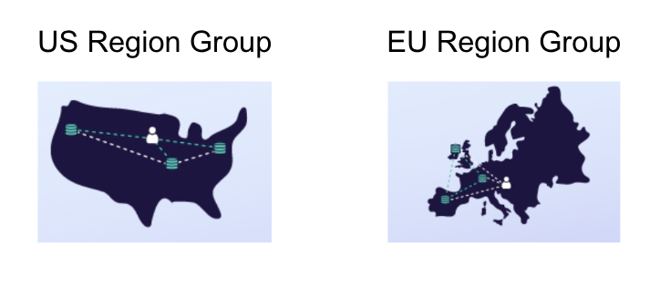

This repository contains unofficial patterns, sample code, or tools to help developers build more effectively with [Fauna][fauna]. All [Fauna Labs][fauna-labs] repositories are provided “as-is” and without support. By using this repository or its contents, you agree that this repository may never be officially supported and moved to the [Fauna organization][fauna-organization].

---

# Node Express with Typescript Fly.io starter for Fauna

A starter kit for Express with Typescript, packaged to run on Fly.io, and using Fauna as the database. 

> Note: Typescript is not a requirement for running Fauna but we've decided to showcase using Fauna
> with Typescript since it is a popular combination. 
 
Whether or not you're looking to run an express server  on Fly, the `package.json`, `tsconfig.json` and `app.ts` files provide a helpful starter kit for combining Typescript with Express. Then the `Dockerfile`, `.dockerignore` and `fly.toml` files make the project ready to deploy on Fly.

---

## Prerequisites
* Node 16 or greater
* [flyctl](https://fly.io/docs/hands-on/install-flyctl/)

## Create a Fauna database and generate an access key

* [Signup](https://dashboard.fauna.com/accounts/register) for a Fauna account if you don't have one already.
* Create a database and access key according to [these instructions](https://docs.fauna.com/fauna/current/learn/quick_start/client_quick_start?lang=javascript).
* Copy the `.env.example` file (in the root of this project) into a new file named `.env` and populate the variable FAUNA_SECRET_KEY with the access key from above:
  ```
  FAUNA_SECRET_KEY="xxxxxxxx-xxxxxxxxx"
  ```

## Test locally

First, build the project:
```
npm install && npm run build
```

__Now, load some sample data (**Note**: This will be using the Fauna key from above, which should now be set in the `.env` file)__:
```
node scripts/run.mjs
```

Then start express:
```
npm start
```

Navigate to `http://localhost:3000/read`

This should perform a read from the Fauna database you created and populated with sample data, per the setup steps above.

### Testing the Docker image

A `Dockerfile` is part of this project, (along with the `fly.toml` file) making the app ready to run on Fly. Building the docker image locally is not necessary to run on Fly, but could be helpful if you're debugging. To test the Docker build, run

```
docker build -t express-ts-fly-io-starter:dev --no-cache .
```

Then 
```
docker run -p 3000:3000 --env FAUNA_SECRET_KEY="<the-fauna-access-key>" express-ts-fly-io-starter:dev
```


## Deploy to Fly.io

To launch the app on fly, run `flyctl launch` in the root directory of this project.
You will be prompted for a few things:

* `? Would you like to copy its configuration to the new app? (y/N)` **Choose y (Yes)**
* `? Choose an app name (leaving blank will default to 'express-ts-fauna-starter')` **⚠️ Give it a new app name**
* Choose an organization
  (You would be defaulted to the "personal" organization if it is the only option)

```bash
% flyctl launch
...
An existing fly.toml file was found for app express-ts-fauna-starter
? Would you like to copy its configuration to the new app? Yes
Scanning source code
Detected a NodeJS app
? Choose an app name (leaving blank will default to 'express-ts-fauna-starter') <a-new-app-name>
automatically selected personal organization: 'your-personal-organization'
App will use 'iad' region as primary

Created app '<a-new-app-name>' in organization 'personal'
Admin URL: https://fly.io/apps/<a-new-app-name>
Hostname: <a-new-app-name>.fly.dev
Wrote config file fly.toml
...
```

Environment variables are not uploaded. Before deploying, you should set the Secrets value for FAUNA_SECRET_KEY: 
```
fly secrets set FAUNA_SECRET_KEY="<fauna secret key>"
```

Now you can deploy:
```
fly deploy
```

Once the application has been deployed, you can find out more about its deployment. 
```
fly status
```

Browse to your newly deployed application with the `fly open` command.
```
% flyctl open

Opening https://<a-new-app-name>.fly.dev
```

## Scale your deployment to match the Fauna footprint

When you create a database in Fauna, it is automatically configured – out of the box – as a three replica database with active-active write capability (For example, if you created a database in the "US Region Group", there will be 3 replicas of the database across the United States). Thus, a good way to take advantage of this architecture is to deploy on 3 Fly.io regions as well, as close as possible to the database replicas.



Currently, Fauna provides 2 choices of Regions Groups, US and EU. The table below lists the Fly regions that are closest to the Fauna replicas of each respective region group:

| Fauna Region Group | Deploy on Fly Regions |
|--------------------|-----------------------|
| EU                 | lhr, arn, fra         |
| US                 | sjc, ord, iad         |

Thus, if you created your database in the US region group, you can scale up your Fly app using this command:

```
fly regions set sjc ord iad
```

Followed by this command:

```
fly scale count 3 --max-per-region=1
```

This would scale up the app to have 3 VMs, each in one of the specified regions.


[fauna]: https://www.fauna.com/
[fauna-labs]: https://github.com/fauna-labs
[fauna-organization]: https://github.com/fauna
